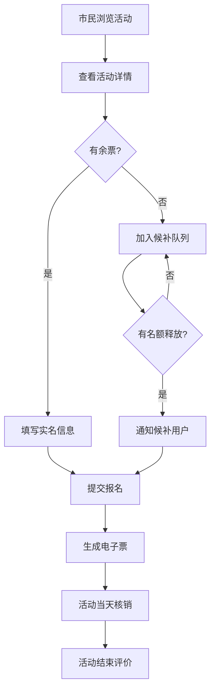

## 1. 产品概述

数字文化馆活动票务系统是一个面向市民和文化馆馆员的综合活动管理平台。市民可浏览、报名各类文化活动（讲座、演出、亲子活动），获取电子票券；馆员负责活动审核、入场核销、数据统计等管理工作。

- 核心价值：简化文化活动报名流程，提升文化馆服务效率，实现活动全生命周期数字化管理
- 目标用户：广大市民（活动参与者）、文化馆工作人员（活动管理者）

## 2. 核心 Features

### 2.1 用户角色

| 角色 | 登录方式 | 核心权限 |
|------|----------|----------|
| 市民用户 | 手机号登录 | 浏览活动、实名报名、查看票券、候补排队、取消报名、活动评价 |
| 馆馆员 | 账号密码登录 | 活动管理、报名审核、签到核销、候补管理、数据统计、黑名单管理、名单导出 |

### 2.2 功能模块

1. **活动列表页**：分类筛选、日历查看、搜索、余票提示
2. **活动详情页**：活动信息、报名表单、多人同行、余票状态、候补按钮
3. **我的票券页**：票券列表、电子票二维码、取消报名、活动评价
4. **馆员后台首页**：数据概览、快捷入口
5. **活动管理页**：活动列表、新增/编辑、场次复制、年龄限制设置
6. **报名审核页**：报名名单、审核操作、黑名单提醒、导出名单
7. **签到核销页**：二维码扫描、手动核销、入场人数统计
8. **候补管理页**：候补队列、名额释放、自动补位通知
9. **数据统计页**：报名统计、核销统计、热门活动、用户画像

### 2.3 页面详情

| 页面名称 | 模块名称 | 功能描述 |
|----------|----------|----------|
| 活动列表 | 分类筛选 | 按活动类型（讲座/演出/亲子）、时间、地点筛选 |
| 活动列表 | 日历视图 | 日历形式展示每日活动，点击查看详情 |
| 活动列表 | 活动卡片 | 展示活动封面、名称、时间、地点、余票状态、报名按钮 |
| 活动列表 | 搜索功能 | 支持按活动名称、地点关键词搜索 |
| 活动详情 | 活动信息 | 活动介绍、时间、地点、票价、年龄限制、剩余票数 |
| 活动详情 | 实名报名 | 填写姓名、身份证号、手机号等实名信息 |
| 活动详情 | 多人同行 | 支持添加同行人信息，最多3人 |
| 活动详情 | 候补排队 | 活动满员时可加入候补队列 |
| 活动详情 | 余票提示 | 实时显示剩余票数，紧张时红色警示 |
| 我的票券 | 票券列表 | 展示所有报名成功的票券，按状态分类 |
| 我的票券 | 电子票生成 | 生成包含二维码的电子票，支持核销 |
| 我的票券 | 取消报名 | 活动前可取消报名，释放名额给候补用户 |
| 我的票券 | 活动评价 | 活动结束后可对活动进行评分和评价 |
| 馆员后台 | 数据概览 | 今日活动数、报名人数、核销人数、热门活动 |
| 活动管理 | 活动CRUD | 新增、编辑、删除活动，设置年龄限制 |
| 活动管理 | 场次复制 | 一键复制活动场次，快速创建重复活动 |
| 报名审核 | 报名列表 | 展示所有报名记录，支持筛选和搜索 |
| 报名审核 | 审核操作 | 通过/拒绝报名，标记黑名单用户 |
| 报名审核 | 黑名单提醒 | 黑名单用户报名时高亮警示 |
| 报名审核 | 名单导出 | 导出报名名单为Excel文件 |
| 签到核销 | 二维码核销 | 扫描电子票二维码快速核销 |
| 签到核销 | 手动核销 | 输入票号或手机号手动核销 |
| 签到核销 | 入场统计 | 实时显示已入场人数、总名额、到场率 |
| 候补管理 | 候补队列 | 展示活动候补列表，按报名时间排序 |
| 候补管理 | 名额释放 | 报名取消后自动通知候补用户 |
| 数据统计 | 多维度统计 | 按活动类型、时间段、用户群体统计 |
| 数据统计 | 可视化图表 | 柱状图、折线图、饼图展示统计数据 |
| 系统通知 | 变更通知 | 活动时间/地点变更时推送通知 |

## 3. 核心流程

### 3.1 市民报名流程
用户浏览活动列表 → 选择活动查看详情 → 填写实名信息（可添加同行人）→ 提交报名 → 报名成功生成电子票 → 活动当天出示二维码核销 → 活动结束后评价

### 3.2 候补流程
活动已满员 → 用户点击候补按钮 → 加入候补队列 → 有用户取消报名 → 系统自动通知候补首位用户 → 用户确认报名 → 生成电子票

### 3.3 馆员核销流程
馆员登录后台 → 进入签到核销页 → 扫描用户二维码/输入票号 → 系统验证票券有效性 → 核销成功 → 实时更新入场统计

## 4. 用户界面设计

### 4.1 设计风格
- 主色调：中国传统靛蓝色 (#165DFF)，搭配朱红色 #E34D59 作为强调色
- 辅色调：米白色背景，深灰色文字，营造文化气息
- 按钮风格：圆角矩形，微阴影，hover时有轻微浮起效果
- 字体：标题使用「思源宋体」体现文化底蕴，正文使用「思源黑体」保证可读性
- 布局风格：卡片式布局，留白充足，顶部导航栏固定
- 图标：线性图标，简约现代，适当融入传统纹样元素

### 4.2 页面设计概述

| 页面名称 | 模块名称 | UI元素 |
|----------|----------|--------|
| 活动列表 | 顶部导航 | Logo、分类标签、搜索框、用户头像 |
| 活动列表 | 筛选区 | 分类切换、日历选择器、地点筛选 |
| 活动列表 | 活动卡片 | 封面图渐变遮罩、活动标签、余票徽章、报名按钮 |
| 活动列表 | 日历视图 | 月历网格，有活动日期标记圆点 |
| 活动详情 | 头部横幅 | 大尺寸封面图、活动标题、时间地点信息 |
| 活动详情 | 信息区 | 标签组、详情介绍、注意事项折叠面板 |
| 活动详情 | 报名表单 | 分步表单，实名信息录入，同行人添加 |
| 活动详情 | 余票显示 | 大号数字显示，不足10%时红色闪烁动画 |
| 我的票券 | 票券卡片 | 拟物化票券设计，虚线分割，二维码区域 |
| 我的票券 | 状态标签 | 待使用/已使用/已取消/已过期，不同颜色 |
| 馆员后台 | 仪表盘 | 数据卡片、统计图表、快捷操作区 |
| 签到核销 | 扫描区 | 大尺寸扫描框，实时核销结果提示 |
| 数据统计 | 图表区 | 响应式图表，支持切换时间维度 |

### 4.3 响应式设计
- Desktop-first 设计，自适应 1280px 及以上
- 平板端：1024px - 1279px，侧边栏收起为图标模式
- 移动端：768px - 1023px，底部导航，卡片单列布局
- 小屏：< 768px，优化触控区域，简化表单

### 4.4 动效设计
- 页面加载：元素淡入，列表项错峰出现
- 卡片hover：轻微上浮 + 阴影加深
- 按钮点击：缩放反馈效果
- 余票紧张：数字脉冲动画
- 核销成功：绿色对勾缩放动画
- 通知提示：顶部滑入，自动消失
