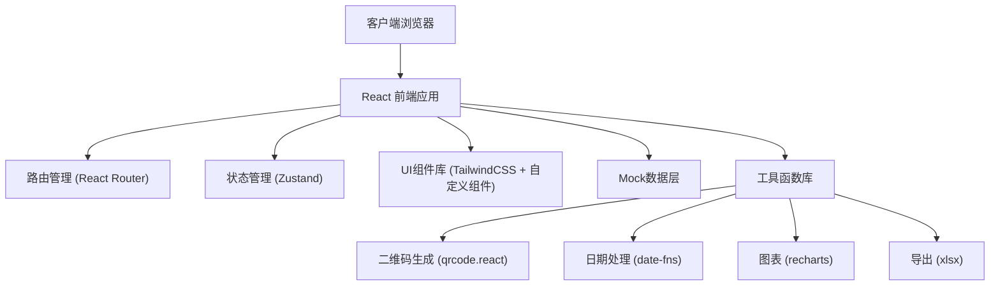
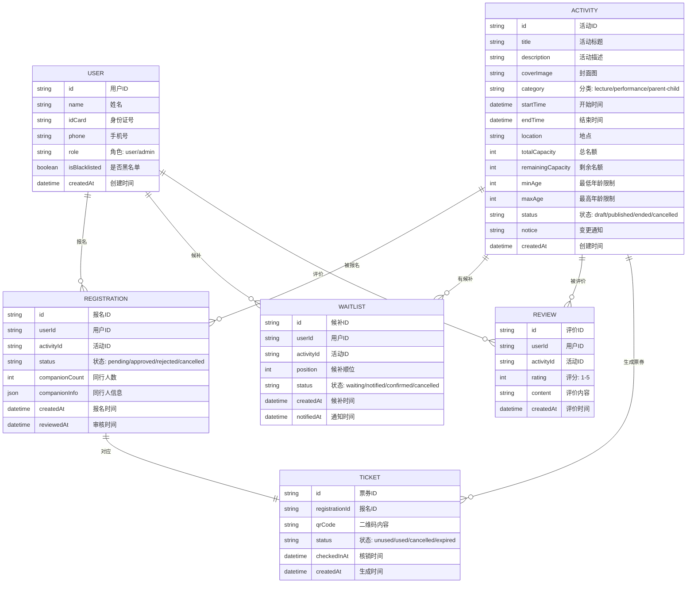

## 1. 架构设计



## 2. 技术描述

- **前端框架**：React@18 + TypeScript@5
- **构建工具**：Vite@5
- **样式方案**：TailwindCSS@3
- **路由管理**：React Router@6
- **状态管理**：Zustand@4
- **UI 图标**：Lucide React
- **二维码**：qrcode.react
- **日期处理**：date-fns
- **图表库**：recharts
- **Excel导出**：xlsx
- **数据方案**：本地 Mock 数据 + localStorage 持久化

## 3. 路由定义

| 路由 | 页面 | 说明 |
|------|------|------|
| `/` | 活动列表页 | 市民端首页，展示活动列表和筛选 |
| `/activity/:id` | 活动详情页 | 活动信息展示和报名 |
| `/tickets` | 我的票券页 | 用户票券列表和电子票 |
| `/admin` | 馆员后台首页 | 数据概览仪表盘 |
| `/admin/activities` | 活动管理页 | 活动CRUD和场次复制 |
| `/admin/registrations` | 报名审核页 | 报名名单审核和导出 |
| `/admin/checkin` | 签到核销页 | 二维码核销和手动核销 |
| `/admin/waitlist` | 候补管理页 | 候补队列管理 |
| `/admin/statistics` | 数据统计页 | 多维度数据统计图表 |
| `/login` | 登录页 | 市民/馆员登录 |

## 4. 数据模型

### 4.1 ER图



### 4.2 核心类型定义

```typescript
// 用户类型
interface User {
  id: string;
  name: string;
  idCard: string;
  phone: string;
  role: 'user' | 'admin';
  isBlacklisted: boolean;
  createdAt: Date;
}

// 活动类型
interface Activity {
  id: string;
  title: string;
  description: string;
  coverImage: string;
  category: 'lecture' | 'performance' | 'parent-child';
  startTime: Date;
  endTime: Date;
  location: string;
  totalCapacity: number;
  remainingCapacity: number;
  minAge: number;
  maxAge: number;
  status: 'draft' | 'published' | 'ended' | 'cancelled';
  notice?: string;
  createdAt: Date;
}

// 报名类型
interface Registration {
  id: string;
  userId: string;
  activityId: string;
  status: 'pending' | 'approved' | 'rejected' | 'cancelled';
  companionCount: number;
  companionInfo: Companion[];
  createdAt: Date;
  reviewedAt?: Date;
}

interface Companion {
  name: string;
  idCard: string;
}

// 票券类型
interface Ticket {
  id: string;
  registrationId: string;
  qrCode: string;
  status: 'unused' | 'used' | 'cancelled' | 'expired';
  checkedInAt?: Date;
  createdAt: Date;
}

// 候补类型
interface Waitlist {
  id: string;
  userId: string;
  activityId: string;
  position: number;
  status: 'waiting' | 'notified' | 'confirmed' | 'cancelled';
  createdAt: Date;
  notifiedAt?: Date;
}

// 评价类型
interface Review {
  id: string;
  userId: string;
  activityId: string;
  rating: number;
  content: string;
  createdAt: Date;
}
```

## 5. 目录结构

```
src/
├── assets/              # 静态资源
│   ├── images/          # 图片资源
│   └── styles/          # 全局样式
├── components/          # 通用组件
│   ├── ui/              # 基础UI组件
│   │   ├── Button.tsx
│   │   ├── Card.tsx
│   │   ├── Input.tsx
│   │   ├── Modal.tsx
│   │   ├── Table.tsx
│   │   ├── Tabs.tsx
│   │   └── Badge.tsx
│   ├── ActivityCard.tsx
│   ├── TicketCard.tsx
│   ├── QRCodeDisplay.tsx
│   ├── CalendarView.tsx
│   ├── CategoryFilter.tsx
│   └── StatCard.tsx
├── pages/               # 页面组件
│   ├── ActivityList.tsx
│   ├── ActivityDetail.tsx
│   ├── MyTickets.tsx
│   ├── admin/
│   │   ├── Dashboard.tsx
│   │   ├── ActivityManagement.tsx
│   │   ├── RegistrationReview.tsx
│   │   ├── CheckIn.tsx
│   │   ├── WaitlistManagement.tsx
│   │   └── Statistics.tsx
│   └── Login.tsx
├── store/               # 状态管理
│   ├── useAuthStore.ts
│   ├── useActivityStore.ts
│   ├── useTicketStore.ts
│   └── useAdminStore.ts
├── mock/                # Mock数据
│   ├── data/
│   │   ├── activities.ts
│   │   ├── users.ts
│   │   ├── registrations.ts
│   │   ├── tickets.ts
│   │   ├── waitlists.ts
│   │   └── reviews.ts
│   └── index.ts
├── utils/               # 工具函数
│   ├── date.ts
│   ├── qrcode.ts
│   ├── export.ts
│   └── validation.ts
├── types/               # 类型定义
│   └── index.ts
├── router/              # 路由配置
│   └── index.tsx
├── App.tsx
└── main.tsx
```

## 6. 核心功能实现说明

### 6.1 报名流程
1. 表单验证：实名信息格式校验、年龄限制校验
2. 余票检查：原子化更新剩余名额
3. 票券生成：使用qrcode.react生成唯一二维码
4. 状态持久化：localStorage存储报名状态

### 6.2 候补队列
1. 按报名时间排序，维护position字段
2. 名额释放时自动通知候补首位用户
3. 支持用户主动退出候补

### 6.3 二维码核销
1. 扫码解析票券ID
2. 验证票券有效性（未使用、对应活动、未过期）
3. 更新票券状态为已使用，记录核销时间
4. 实时更新入场人数统计

### 6.4 数据统计
1. 使用recharts绘制各类图表
2. 支持按时间维度筛选
3. 实时计算到场率、热门活动排行等

### 6.5 名单导出
1. 使用xlsx库生成Excel文件
2. 支持筛选后导出
3. 导出字段：姓名、手机号、身份证号、报名时间、状态等
